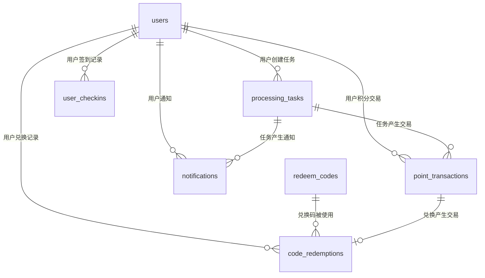

# 智译平台数据库操作db文档

## 目录结构

智译平台的数据库操作相关代码主要位于`db`目录下，该目录结构如下：

```
db/
├── index.ts                    # 数据库连接和基础操作
├── schema/                     # 存放数据库模式定义文件
│   ├── users.ts               # 用户表结构定义
│   ├── processing-tasks.ts    # 处理任务表结构定义
│   ├── point-transactions.ts  # 积分交易表结构定义
│   ├── user-checkins.ts       # 用户签到表结构定义
│   ├── redeem-codes.ts        # 兑换码表结构定义
│   ├── code-redemptions.ts    # 兑换记录表结构定义
│   ├── notifications.ts       # 通知表结构定义
│   └── index.ts               # 导出所有表结构
├── migrations/                 # 数据库迁移文件
│   ├── 0000_sharp_silverclaw.sql      # 初始数据库结构
│   ├── 0001_vengeful_cobalt_man.sql   # 第一次迁移
│   ├── 0002_tricky_typhoid_mary.sql   # 第二次迁移
│   ├── 0003_last_mariko_yashida.sql   # 第三次迁移
│   └── meta/                  # 迁移元数据
└── queries/                    # 复杂查询封装（目前为空）
```

## 数据库连接

数据库连接在`db/index.ts`中配置，使用Drizzle ORM连接PostgreSQL数据库：

```typescript
import { drizzle } from 'drizzle-orm/postgres-js';
import postgres from 'postgres';
import * as schema from './schema';

const connectionString = process.env.DATABASE_URL!;

// Disable prefetch as it is not supported for "Transaction" pool mode
const client = postgres(connectionString, { prepare: false });
export const db = drizzle(client, { schema });

export * from './schema';
```

## 数据库表结构

### 用户表 (users)

用户表存储用户基本信息和积分状态：

```typescript
export const users = pgTable('users', {
  id: serial('id').primaryKey(),
  userId: varchar('user_id', { length: 255 }).notNull().unique(),
  email: varchar('email', { length: 255 }),
  points: integer('points').default(100).notNull(),
  hasInfinitePoints: boolean('has_infinite_points').default(false),
  membershipType: varchar('membership_type', { length: 50 }).default('free'),
  membershipExpiry: date('membership_expiry'),
  createdAt: timestamp('created_at').defaultNow(),
  updatedAt: timestamp('updated_at').defaultNow(),
});
```

- `id`: 自增主键
- `userId`: 外部身份标识（Casdoor 用户名），唯一
- `email`: 用户邮箱（可为空，Casdoor 注册有邮箱时写入）
- `points`: 用户积分余额，默认100积分
- `hasInfinitePoints`: 是否拥有无限积分
- `membershipType`: 会员类型
- `membershipExpiry`: 会员过期日期
- `createdAt`: 创建时间
- `updatedAt`: 更新时间

### 处理任务表 (processing_tasks)

处理任务表记录用户提交的所有文件处理任务：

```typescript
export const processingTasks = pgTable('processing_tasks', {
  id: serial('id').primaryKey(),
  userId: varchar('user_id', { length: 255 }).notNull().references(() => users.userId, { onDelete: 'cascade' }),
  
  // 任务信息
  taskType: varchar('task_type', { length: 50 }).notNull(), // pdf_to_markdown, translation, etc.
  taskStatus: varchar('task_status', { length: 20 }).default('pending').notNull(), // pending, processing, completed, failed
  progressPercent: integer('progress_percent').default(0),
  statusMessage: text('status_message'),
  
  // 输入文件
  inputFilename: varchar('input_filename', { length: 255 }).notNull(),
  inputFileSize: bigint('input_file_size', { mode: 'number' }).notNull(),
  inputStoragePath: varchar('input_storage_path', { length: 500 }).notNull(), // 外部存储路径
  
  // 处理参数
  processingParams: jsonb('processing_params').default({}),
  
  // 外部服务
  externalTaskId: varchar('external_task_id', { length: 255 }),
  
  // 积分
  estimatedPoints: integer('estimated_points').default(0),
  actualPointsUsed: integer('actual_points_used').default(0),
  
  // 结果
  resultStoragePath: varchar('result_storage_path', { length: 500 }),
  resultFileSize: bigint('result_file_size', { mode: 'number' }),
  resultFilename: varchar('result_filename', { length: 255 }), // 供下载的文件名
  
  // 错误处理
  errorCode: varchar('error_code', { length: 50 }),
  errorMessage: text('error_message'),
  retryCount: integer('retry_count').default(0),
  
  // 时间管理
  createdAt: timestamp('created_at').defaultNow(),
  startedAt: timestamp('started_at'),
  completedAt: timestamp('completed_at'),
  expiresAt: timestamp('expires_at').defaultNow(), // 默认7天后过期
});
```

主要字段说明：
- `taskType`: 任务类型，如pdf_to_markdown, translation等
- `taskStatus`: 任务状态，包括pending, processing, completed, failed
- `processingParams`: JSON格式的处理参数
- `estimatedPoints`/`actualPointsUsed`: 预估和实际使用的积分
- `expiresAt`: 结果过期时间，默认7天后过期

### 积分交易表 (point_transactions)

记录用户积分的所有变动：

```typescript
export const pointTransactions = pgTable('point_transactions', {
  id: serial('id').primaryKey(),
  userId: varchar('user_id', { length: 255 }).notNull().references(() => users.userId, { onDelete: 'cascade' }),
  taskId: integer('task_id').references(() => processingTasks.id, { onDelete: 'set null' }),
  amount: integer('amount').notNull(),
  transactionType: varchar('transaction_type', { length: 50 }).notNull(),
  description: text('description').notNull(),
  createdAt: timestamp('created_at').defaultNow(),
});
```

- `amount`: 积分变动数量
- `transactionType`: 交易类型，如任务消费、签到奖励、兑换码等
- `description`: 交易描述

### 用户签到表 (user_checkins)

记录用户每日签到情况：

```typescript
export const userCheckins = pgTable('user_checkins', {
  id: serial('id').primaryKey(),
  userId: varchar('user_id', { length: 255 }).notNull().references(() => users.clerkId, { onDelete: 'cascade' }),
  checkinDate: date('checkin_date').notNull(),
  pointsEarned: integer('points_earned').default(5),
  createdAt: timestamp('created_at').defaultNow(),
}, (table) => {
  return {
    userDateIdx: uniqueIndex('user_checkins_user_id_checkin_date_unique').on(table.userId, table.checkinDate),
  }
});
```

- `checkinDate`: 签到日期
- `pointsEarned`: 获得的积分，默认5积分

### 兑换码表 (redeem_codes)

存储系统中的积分兑换码：

```typescript
export const redeemCodes = pgTable('redeem_codes', {
  id: serial('id').primaryKey(),
  code: varchar('code', { length: 50 }).notNull().unique(),
  pointsValue: integer('points_value').notNull(),
  maxUses: integer('max_uses'),
  currentUses: integer('current_uses').default(0),
  isActive: boolean('is_active').default(true),
  expiresAt: timestamp('expires_at'),
  createdAt: timestamp('created_at').defaultNow(),
});
```

- `code`: 兑换码字符串
- `pointsValue`: 兑换码价值的积分
- `maxUses`/`currentUses`: 最大使用次数和当前使用次数
- `isActive`: 是否激活
- `expiresAt`: 过期时间

### 兑换记录表 (code_redemptions)

记录用户兑换码使用情况：

```typescript
export const codeRedemptions = pgTable('code_redemptions', {
  id: serial('id').primaryKey(),
  codeId: integer('code_id').notNull().references(() => redeemCodes.id, { onDelete: 'cascade' }),
  userId: varchar('user_id', { length: 255 }).notNull().references(() => users.clerkId, { onDelete: 'cascade' }),
  pointsEarned: integer('points_earned').notNull(),
  transactionId: integer('transaction_id').references(() => pointTransactions.id),
  createdAt: timestamp('created_at').defaultNow(),
}, (table) => {
  return {
    codeUserIdx: uniqueIndex('code_redemptions_code_id_user_id_unique').on(table.codeId, table.userId),
  }
});
```

- `codeId`: 关联的兑换码ID
- `userId`: 使用兑换码的用户ID
- `pointsEarned`: 获得的积分
- `transactionId`: 关联的积分交易记录ID

### 通知表 (notifications)

存储用户通知信息：

```typescript
export const notifications = pgTable('notifications', {
  id: serial('id').primaryKey(),
  userId: varchar('user_id', { length: 255 }).notNull().references(() => users.clerkId, { onDelete: 'cascade' }),
  title: varchar('title', { length: 255 }).notNull(),
  message: text('message').notNull(),
  type: varchar('type', { length: 50 }).notNull(), // info, success, warning, error
  isRead: boolean('is_read').default(false),
  relatedTaskId: integer('related_task_id').references(() => processingTasks.id, { onDelete: 'set null' }),
  createdAt: timestamp('created_at').defaultNow(),
});
```

- `title`: 通知标题
- `message`: 通知内容
- `type`: 通知类型，如info, success, warning, error
- `isRead`: 是否已读
- `relatedTaskId`: 关联的任务ID

## 数据库迁移

智译平台使用Drizzle ORM的迁移功能管理数据库结构变更。迁移文件位于`db/migrations`目录下：

1. `0000_sharp_silverclaw.sql`: 初始数据库结构，创建所有基础表
2. `0001_vengeful_cobalt_man.sql`: 第一次迁移
3. `0002_tricky_typhoid_mary.sql`: 第二次迁移
4. `0003_last_mariko_yashida.sql`: 第三次迁移

## 数据库使用示例

### 导入数据库连接

```typescript
import { db } from '@/db';
import { users, processingTasks } from '@/db/schema';
```

### 查询操作

```typescript
// 查询用户
const user = await db.query.users.findFirst({
  where: (users, { eq }) => eq(users.clerkId, clerkId)
});

// 查询用户的处理任务
const tasks = await db.query.processingTasks.findMany({
  where: (tasks, { eq }) => eq(tasks.userId, userId),
  orderBy: (tasks, { desc }) => [desc(tasks.createdAt)]
});
```

### 插入操作

```typescript
// 创建新用户
const newUser = await db.insert(users).values({
  clerkId,
  email,
  points: 100,
}).returning();

// 创建新任务
const newTask = await db.insert(processingTasks).values({
  userId,
  taskType: 'pdf_to_markdown',
  inputFilename,
  inputFileSize,
  inputStoragePath,
  processingParams: { translateTo: 'zh' },
  estimatedPoints: 10,
}).returning();
```

### 更新操作

```typescript
// 更新用户积分
await db.update(users)
  .set({ points: user.points - pointsToDeduct })
  .where(eq(users.clerkId, userId));

// 更新任务状态
await db.update(processingTasks)
  .set({ 
    taskStatus: 'completed',
    progressPercent: 100,
    completedAt: new Date(),
    resultFilename,
    resultStoragePath,
    resultFileSize
  })
  .where(eq(processingTasks.id, taskId));
```

### 删除操作

```typescript
// 删除过期任务
await db.delete(processingTasks)
  .where(lt(processingTasks.expiresAt, new Date()));
```

### 事务操作

```typescript
// 在事务中执行积分扣除和任务创建
await db.transaction(async (tx) => {
  // 扣除用户积分
  await tx.update(users)
    .set({ points: user.points - estimatedPoints })
    .where(eq(users.clerkId, userId));
    
  // 创建任务记录
  const [task] = await tx.insert(processingTasks).values({
    userId,
    taskType,
    inputFilename,
    inputFileSize,
    inputStoragePath,
    estimatedPoints,
  }).returning();
  
  // 记录积分交易
  await tx.insert(pointTransactions).values({
    userId,
    taskId: task.id,
    amount: -estimatedPoints,
    transactionType: 'TASK_DEDUCTION',
    description: `任务消费: ${taskType}`,
  });
  
  return task;
});
```


## 数据库关系图

