# PDF解析Markdown架构设计文档

## 项目目标

构建一个智能PDF文档解析系统，将PDF文档转换为结构化的Markdown格式，支持翻译功能和调试模式。

## 项目逻辑

### 整体架构图

```
[PDF输入] → [预处理器] → [版面检测] → [阅读顺序] → [内容解析] →  [标题分级] → [组装器] → [输出管理] → [格式转换器]
    ↓         ↓           ↓          ↓          ↓        		↓ 			 ↓         ↓              ↓
 [缓存]   [旋转检测]  [调试输出]  [调试输出]  [调试输出]  	   [调试输出]	[翻译器]  [文件生成]   [多格式导出]
```

### 具体逻辑

1. 预处理阶段：

   - 将PDF页面转换为图像
   - 检测文档语言
   - 页面旋转检测（使用PaddleOCR自动检测并纠正页面旋转）

2. 使用版面检测模型（本地模型）区分：

   文档标题、段落标题、文本块、页码、摘要、目录、参考文献、脚注、页眉、页脚、图像、表格、图题、表题、算法框、侧栏文本、代码块、化学式

   对需要存储成图片的内容进行裁剪

3. 使用阅读顺序模型（本地模型）确定不同模块的顺序

4. 将文档标题、段落标题、文本块、摘要、目录、参考文献、脚注、表格、图题、表题、算法框、侧栏文本、代码块根据类别分别送入不同的vlm模型（本地模型）解析成markdown

   >就是将需要解析成文本的部分送入vlm，目前仅送入原装smoldocling即可，后续针对性的模型慢慢微调

5. 将数据组装成标准markdown文件

   * 文档表题和段落标题解析好后，送入接入LLM模型的api对标题进行分级，和普通文本区分开，使用markdown标题语法：`##`

   * 脚注需要和普通文本区分开

     >当前简单使用上下两个`-–-`分开即可

   * 保存图像，生成图片文件夹，在正确位置插入相对路径

6. 如果要求“翻译”，将“文档标题、段落标题、文本块、摘要、目录、脚注、图题、表题、侧栏文本”的markdown结果送入LLM模型（api）得到对应翻译，生成以下文件结构，其中markdown文件保持排版

   >output/
   >├── images/                          # 存放图像
   >├── 原文.md
   >├── 译文.md
   >├── 原文+译文.md	# 原文+对应译文

7. 如果要求“调试”，文件结构如下

   >output/
   >├── images/                          # 存放图像
   >├── 原文.md
   >├── 译文.md
   >├── 原文+译文.md	# 原文+对应译文
   >├── 中间文件/
   >    ├── 版面检测模型的结果
   >    ├── 阅读顺序模型的结果
   >    ├── vlm模型解析的结果
   >    ├── 标题分级的结果

8. 格式转换器：
   支持多种输出格式：Markdown、PDF、HTML、Word、LaTeX
   使用Pandoc进行格式转换，支持不同的PDF主题

### 文件结构

```
pdf_to_markdown/
├── main.py                        # 主入口文件（CLI）
├── requirements.txt               # Python依赖
├── README.md                      # 项目说明文档
├── 
├── src/                           # 源代码目录
│   ├── __init__.py
│   ├── core/                      # 核心模块
│   │   ├── __init__.py
│   │   ├── data_structures.py     # 数据结构定义
│   │   ├── processor.py           # 主处理器（支持并行处理不同页面）
│   │
│   ├── modules/                   
│   │   ├── __init__.py
│   │   ├── preprocessor.py        # PDF预处理
│   │   ├── rotation_detector.py   # 页面旋转检测模块
│   │   ├── layout_detector.py     # 版面检测
│   │   ├── order_analyzer.py      # 阅读顺序分析
│   │   ├── content_parser.py      # 内容解析
│   │   ├── heading_levels.py      # 标题分级
│   │   ├── translator.py          # 翻译模块
│   │   ├── assembler.py           # 文档组装
│   │   ├── output_manager.py      # 输出管理
│   │   └── format_converter.py    # 格式转换器模块
│   │
│   ├── config/                    # 配置模块
│   │   ├── model_config.json      # 模型配置文件
│   │   └── model_config.py        # 模型配置类
│   │
│   ├── utils/                     # 工具模块
│   │   ├── __init__.py
│   │   ├── image_utils.py         # 图像处理工具
│   │   ├── file_utils.py          # 文件操作工具
│   │   ├── memory_manager.py      # 内存管理
│   │   ├── logger.py             # 日志工具
│   │
│   └── api/                      # API接口
│
├── models/                       # 模型文件存储
│   ├── layout/                   # 版面检测模型
│   │   ├── inference.json
│   │   ├── inference.pdiparams
│   │   └── inference.yml
│   ├── order/                    # 阅读顺序模型
│   │   ├── model.pth
│   │   └── config.json
│   ├── rotation/                  # 旋转检测模型
│   └── vlm/                     # VLM模型
│       ├── text_parser/
│       ├── table_parser/
│       ├── ...
│
│
├── tests/                       # 测试目录
│   ├── __init__.py
│   ├── test_preprocessor.py     # 预处理测试
│   ├── test_layout_detector.py  # 版面检测测试
│   ├── test_content_parser.py   # 内容解析测试
│   ├── test_translator.py       # 翻译测试
│   ├── test_headinglevels.py    # 分级测试
│   ├── test_assembler.py        # 组装测试
│   └── fixtures/                # 测试数据
│       ├── sample_pdfs/
│       └── expected_outputs/
│
├── data/                        # 数据目录
│   ├── input/                   # 输入PDF存放
│   ├── output/                  # 输出结果存放
│   ├── temp/                    # 临时文件（测试用）
│
├── Doc/                         # 存放项目文档
```

## 数据结构定义

### 基础数据结构

```python
from dataclasses import dataclass, field
from typing import List, Optional, Dict, Any, Tuple
from enum import Enum
from datetime import datetime

@dataclass
class BoundingBox:
    """
    边界框坐标信息
    用于定位PDF页面中的元素位置和大小
    """
    x: float              # 左上角X坐标（相对于页面左上角）
    y: float              # 左上角Y坐标（相对于页面左上角）
    width: float          # 元素宽度（像素或点）
    height: float         # 元素高度（像素或点）
    page_num: int         # 所属页面号（从1开始）

class ElementType(Enum):
    """
    PDF内容元素类型枚举
    定义了版面检测模型能够识别的所有元素类型
    """
    PARAGRAPH_TITLE = "paragraph_title"      # 段落标题
    IMAGE = "image"                          # 图像
    TEXT = "text"                            # 文本
    PAGE_NUMBER = "number"                   # 页码
    ABSTRACT = "abstract"                    # 摘要
    TABLE_OF_CONTENTS = "content"            # 目录
    TABLE = "table"                          # 表格
    REFERENCE = "reference"                  # 参考文献
    DOCUMENT_TITLE = "doc_title"             # 文档标题
    FOOTNOTE = "footnote"                    # 脚注
    HEADER = "header"                        # 页眉
    ALGORITHM = "algorithm"                  # 算法
    CODE_BLOCK = "code"                      # 代码块
    CHEMICAL_FORMULA = "chemical_formula"    # 化学式
    FOOTER = "footer"                        # 页脚
    CHART = "chart"                          # 数据统计类图表
    FIGURE_CAPTION = "figure_title"          # 图像标题（注释）
    TABLE_CAPTION = "table_title"            # 表格标题（注释）
    CHART_CAPTION = "chart_title"            # 图表（统计图）标题（注释）
    ASIDE_TEXT = "aside_text"                # 侧边文本

# 置信度直接使用float类型 (0.0-1.0)，越高表示模型越确信
```

### 页面级数据结构

```python
@dataclass
class PDFPage:
    """
    PDF页面信息
    包含页面基本属性和检测到的语言
    """
    page_num: int                           # 页面编号（从1开始）
    width: float                            # 页面宽度（点或像素）
    height: float                           # 页面高度（点或像素）
    dpi: int                               # 图像分辨率（每英寸点数）
    rotation: int                          # 页面旋转角度（0, 90, 180, 270度）
    detected_language: Optional[str]       # 检测到的主要语言代码（如"en", "zh"）
    
    # 仅调试模式使用
    image_path: Optional[str] = None       # 页面转换后的图像文件路径（调试模式）
```

### 版面检测数据结构

```python
@dataclass
class LayoutElement:
    """
    版面检测结果元素
    经过版面检测模型分析后，具有语义类型的元素
    """
    element_id: str                        # 全局唯一标识符（格式：page_num-element_index）
    element_type: ElementType              # 元素语义类型（如标题、段落、表格等）
    bbox: BoundingBox                      # 元素边界框
    confidence: float                      # 版面检测的置信度 (0.0-1.0)
    
@dataclass
class LayoutDetectionResult:
    """
    单页版面检测结果
    包含该页面所有检测到的布局元素
    """
    page_num: int                          # 页面编号
    elements: List[LayoutElement]          # 检测到的布局元素列表
    processing_time: float                 # 处理耗时（秒）
```

### 阅读顺序数据结构

```python
@dataclass
class ReadingOrderElement:
    """
    阅读顺序元素
    为布局元素分配阅读顺序
    """
    element_id: str                        # 对应的布局元素ID
    order_index: int                       # 在当前页面的阅读顺序索引（从0开始）
    confidence: float                      # 阅读顺序预测的置信度 (0.0-1.0)

@dataclass
class ReadingOrderResult:
    """
    单页阅读顺序分析结果
    包含该页面元素的完整阅读顺序信息
    """
    page_num: int                          # 页面编号
    ordered_elements: List[ReadingOrderElement]  # 按阅读顺序排列的元素列表
    processing_time: float                 # 处理耗时（秒）
```

### 内容解析数据结构

```python
@dataclass
class ImageInfo:
    """
    图像信息
    记录图像处理和存储的相关信息（包括表格、化学式的图像形式）
    """
    element_id: str                        # 对应的元素ID
    original_bbox: BoundingBox             # 在原PDF中的位置
    saved_path: str                        # 保存的图像文件路径（相对于images目录）
    width: int                             # 图像宽度（像素）
    height: int                            # 图像高度（像素）
    format: str                            # 图像格式（如"PNG", "JPEG"）
    file_size: int                         # 文件大小（字节）

@dataclass
class ContentBlock:
    """
    内容块
    """
    element_id: str                        # 对应的布局元素ID
    element_type: ElementType              # 元素类型
    
    # 核心内容 - 直接从模型输出，无JSON转义问题
    raw_markdown: str                      # 纯markdown格式的内容，保持原始格式
    
    # 翻译内容（仅在要求翻译时使用）
    trans_markdown: Optional[str] = None   # 翻译后的markdown内容
    
    # 图像信息（IMAGE、TABLE、CHEMICAL_FORMULA类型使用）
    image_info: Optional[ImageInfo] = None # 图像信息（用于图像、表格、化学式）
    confidence: float = 1.0                # 内容解析置信度
    

@dataclass
class ContentParsingResult:
    """
    单页内容解析结果
    包含该页面所有元素的解析结果
    """
    page_num: int                          # 页面编号
    content_blocks: List[ContentBlock]     # 内容块列表
    processing_time: float                 # 总处理耗时（秒）
    success_count: int                     # 成功解析的元素数量
    failed_elements: List[str]             # 解析失败的元素ID列表
```

### 标题分级数据结构

```python
@dataclass
class HeadingLevel:
    """
    标题级别信息
    记录LLM模型重新分级后的标题级别
    """
    element_id: str                        # 对应的元素ID
    original_level: int                    # 原始级别（文档标题=1，段落标题=2）
    semantic_level: int                    # LLM语义分级后的级别（1-6）
    confidence: float                      # 分级的置信度 (0.0-1.0)

@dataclass
class HeadingLevelingResult:
    """
    标题分级结果
    包含所有标题的语义分级信息
    """
    heading_levels: List[HeadingLevel]     # 标题级别列表（按文档顺序）
    processing_time: float                 # 处理耗时（秒）
    total_headings: int                    # 总标题数量
```

### 文档组装数据结构

```python
@dataclass
class AssembledDocument:
    """
    组装完成的文档
    包含完整的文档结构和内容
    """
    # 基本信息
    detected_language: str                 # 检测到的主要语言
    total_pages: int                       # 总页数
    
    # 有序内容（按阅读顺序排列）
    ordered_content_blocks: List[ContentBlock]  # 按全局阅读顺序排列的内容块
    
    # 标题分级信息
    heading_levels: List[HeadingLevel]     # 标题分级结果
    
    # 图像列表
    images: List[ImageInfo]                # 所有图像信息（包括表格、化学式的图像形式）
    
    # 翻译设置
    translation_enabled: bool = False      # 是否启用了翻译
    target_language: Optional[str] = None  # 目标语言（如果启用翻译）
    
    # 处理统计
    total_elements: int = 0                    # 总元素数
    successful_elements: int = 0               # 成功处理的元素数
    failed_elements: List[str] = field(default_factory=list)             # 失败元素的ID列表
    total_processing_time: float = 0.0           # 总处理时间（秒）
```

### 输出管理数据结构

```python
class OutputFormat(Enum):
    """输出格式选项"""
    MARKDOWN = "markdown"  # Markdown 格式（默认）
    PDF = "pdf"           # PDF 格式
    HTML = "html"         # HTML 格式
    WORD = "word"         # Word 文档格式
    LATEX = "latex"       # LaTeX 格式

class PDFTheme(Enum):
    """PDF 输出主题选项"""
    DEFAULT = "default"  # 默认主题
    ELEGANT = "elegant"  # 优雅主题
    MODERN = "modern"    # 现代主题

@dataclass
class OutputConfiguration:
    """
    输出配置
    定义输出格式和选项
    """
    include_translation: bool = False      # 是否包含翻译
    include_debug: bool = False            # 是否包含调试信息
    
    # 表格和化学式输出方式选择
    table_output_mode: str = "image"      # 表格输出方式："image"（图片）或"markdown"（VLM解析结果）
    formula_output_mode: str = "image"    # 化学式输出方式："image"（图片）或"markdown"（VLM解析结果）
    
    # 图像设置
    image_format: str = "png"              # 图像输出格式

@dataclass
class OutputFile:
    """
    输出文件信息
    记录生成的文件详情
    """
    file_type: str                         # 文件类型："original_md", "translated_md", "combined_md", "pdf", "html", "word", "latex"
    file_path: str                         # 文件完整路径
    size_bytes: int                        # 文件大小（字节）
    created_at: datetime                   # 创建时间

@dataclass
class OutputResult:
    """
    输出结果
    记录完整的输出信息和状态
    """
    output_directory: str                  # 输出目录路径
    files: List[OutputFile]                # 生成的文件列表
    image_directory: str                   # 图像存储目录（images文件夹）
    debug_directory: Optional[str] = None  # 调试信息目录（如果启用）
    
    # 执行状态
    success: bool = True                   # 是否成功完成
    errors: List[str] = field(default_factory=list)  # 错误信息列表
    warnings: List[str] = field(default_factory=list)  # 警告信息列表
    
    # 使用的配置
    configuration: OutputConfiguration = field(default_factory=OutputConfiguration)     # 使用的输出配置
```

### 调试和状态数据结构

```python
@dataclass
class DebugInfo:
    """
    调试信息
    记录处理过程的关键信息
    """
    stage_name: str                        # 处理阶段名称
    processing_time: float                 # 处理耗时（秒）
    memory_usage: float                    # 内存使用量（MB）
    success: bool                          # 是否成功
    page_num: Optional[int] = None         # 页面编号（如果适用）
    element_id: Optional[str] = None       # 相关元素ID（如果适用）
    error_message: Optional[str] = None    # 错误信息（如果有）
    timestamp: datetime = field(default_factory=datetime.now)  # 时间戳

@dataclass
class ProcessingState:
    """
    处理状态
    跟踪整个文档处理的进度和状态
    """
    pdf_path: str                          # 输入PDF文件路径
    current_stage: str                     # 当前处理阶段
    completed_stages: List[str]            # 已完成的阶段列表
    
    # 进度信息
    total_pages: int                       # 总页数
    processed_pages: int = 0               # 已处理页数
    progress_percentage: float = 0.0        # 进度百分比（0.0-100.0）
    
    # 调试信息（仅调试模式）
    debug_enabled: bool = False            # 是否启用调试模式
    debug_info: List[DebugInfo] = field(default_factory=list)  # 调试信息列表
    
    # 时间统计
    start_time: datetime = field(default_factory=datetime.now)  # 开始处理时间
    estimated_completion: Optional[datetime] = None  # 预计完成时间
```

## 数据流设计

### 2.1 预处理阶段

```
输入: PDF文件路径 (str)
预处理: [PDF文件] ---> [页面图像生成 + 语言检测 + 旋转检测]
旋转检测: [页面图像] --PaddleOCR--> [旋转角度检测 + 自动纠正]
输出: List[PDFPage] + ProcessingState初始化
更新: ProcessingState.completed_stages.append("preprocessing")
```

### 2.2 版面检测阶段

```
输入: List[PDFPage] (页面图像)
版面检测: [页面图像] --版面检测模型--> [LayoutElement列表]
输出: List[LayoutDetectionResult] + 更新ProcessingState
更新: ProcessingState.completed_stages.append("layout_detection")
```

### 2.3 阅读顺序分析阶段

```
输入: List[LayoutDetectionResult] (LayoutElement列表)
阅读顺序: [LayoutElement列表] --阅读顺序模型--> [ReadingOrderElement列表]
输出: List[ReadingOrderResult] + 更新ProcessingState
更新: ProcessingState.completed_stages.append("reading_order")
```

### 2.4 内容解析阶段

```
输入: List[ReadingOrderResult] + List[LayoutDetectionResult]
内容解析: [有序的LayoutElement] --VLM模型--> [ContentBlock列表（纯markdown）]
输出: List[ContentParsingResult] + 更新ProcessingState
更新: ProcessingState.completed_stages.append("content_parsing")
```

### 2.5 标题分级阶段

```
输入: List[ContentParsingResult] (筛选所有标题的markdown文本)
标题分级: [按顺序的标题markdown文本] --LLM模型--> [语义分级结果]
输出: HeadingLevelingResult + 更新ProcessingState
更新: ProcessingState.completed_stages.append("heading_leveling")
```

### 2.6 翻译阶段

```
输入: List[ContentParsingResult] (筛选需翻译的ContentBlock.raw_markdown)
翻译: [源语言markdown] --LLM翻译模型--> [目标语言markdown]
输出: 更新ContentBlock.trans_markdown字段 + 更新ProcessingState
更新: ProcessingState.completed_stages.append("translation")
```

### 2.7 文档组装阶段

```
输入: List[ContentParsingResult] + HeadingLevelingResult
组装: [有序ContentBlock + 标题分级] ---> [AssembledDocument]
输出: AssembledDocument + 更新ProcessingState
更新: ProcessingState.completed_stages.append("assembly")
```

### 2.8 输出管理阶段

```
输入: AssembledDocument + ProcessingState + OutputConfiguration
输出管理: [结构化文档] ---> [.md文件 + images目录 + 可选调试文件]
输出: 基础文件 + 更新ProcessingState
更新: ProcessingState.completed_stages.append("output_generation")
```

### 2.9 格式转换阶段

```
输入: [Markdown文件] + [输出格式配置] + [PDF主题配置]
格式转换: [.md文件] --Pandoc--> [多种格式文件]
支持格式: PDF, HTML, Word, LaTeX
输出: OutputResult包含所有格式的文件路径
更新: ProcessingState.completed_stages.append("format_conversion")

文件结构:
├── output/
│   ├── images/                    # 所有图像（包括表格、化学式）
│   ├── 原文.md                    # 原文markdown
│   ├── 译文.md                    # 译文markdown（如果翻译）
│   ├── 原文+译文.md               # 双语对照（如果翻译）
│   ├── 原文.pdf                   # PDF格式（如果选择）
│   ├── 原文.html                  # HTML格式（如果选择）
│   ├── 原文.docx                  # Word格式（如果选择）
│   ├── 原文.tex                   # LaTeX格式（如果选择）
│   └── debug/                     # 调试信息（如果启用）
```

>[!caution]
>
>考虑到目前大模型普遍有转义
>
>```
>例如：$\nabla$ 如果是文本中的一个符号，如果要求大模型使用json结构输出，$\nabla$ 应该进行转义：$\\nabla$，但是由于"\n" 本身有意义，所以可能导致模型遗漏对$\nabla$的转义
>```
>
>所以应当要求模型对于所有vlm和LLM模型，输入提示词应当使用普通markdown格式，并且要求模型输出也是普通markdown格式。
>
>实际的数据结构使用时，用专门字段存储结构信息，内容字段只存原始文本，直接处理纯文本，不经过JSON序列化

> [!note]
>
> * 预处理阶段不进行原始元素提取，仅生成页面图像、判断语言
> * images文件夹是根据版面检测模型的结果裁剪
> * 版面检测模型的结果中的文档标题、段落标题进入vlm模型进行解析，默认文档标题使用一级标题“#”，段落标题使用二级标题"##"。然后所有的标题markdown文本（标题文本的先后顺序依照页面顺序，同一页面依照阅读顺序）会进入LLM模型，得到所有模型的语义分级结果（并不改变顺序）并更新数据结构

## 数据结构关系


​    

```mermaid
graph TD
    %% 基础数据结构
    BoundingBox["`**BoundingBox**
    x: float
    y: float  
    width: float
    height: float
    page_num: int`"]
    
    ElementType["`**ElementType (Enum)**
    PARAGRAPH_TITLE = 'paragraph_title'
    IMAGE = 'image'
    TEXT = 'text'
    PAGE_NUMBER = 'number'
    ABSTRACT = 'abstract'
    TABLE_OF_CONTENTS = 'content'
    TABLE = 'table'
    REFERENCE = 'reference'
    DOCUMENT_TITLE = 'doc_title'
    FOOTNOTE = 'footnote'
    HEADER = 'header'
    ALGORITHM = 'algorithm'
    CODE_BLOCK = 'code'
    CHEMICAL_FORMULA = 'chemical_formula'
    FOOTER = 'footer'
    CHART = 'chart'
    FIGURE_CAPTION = 'figure_title'
    TABLE_CAPTION = 'table_title'
    CHART_CAPTION = 'chart_title'
    ASIDE_TEXT = 'aside_text'`"]

    %% 输出格式相关枚举
    OutputFormat["`**OutputFormat (Enum)**
    MARKDOWN = 'markdown'
    PDF = 'pdf'
    HTML = 'html'
    WORD = 'word'
    LATEX = 'latex'`"]

    PDFTheme["`**PDFTheme (Enum)**
    DEFAULT = 'default'
    ELEGANT = 'elegant'
    MODERN = 'modern'`"]

    %% 页面级数据结构
    PDFPage["`**PDFPage**
    page_num: int
    width: float
    height: float
    dpi: int
    rotation: int
    detected_language: Optional[str]
    image_path: Optional[str]`"]

    %% 版面检测数据结构
    LayoutElement["`**LayoutElement**
    element_id: str
    element_type: ElementType
    bbox: BoundingBox
    confidence: float`"]

    LayoutDetectionResult["`**LayoutDetectionResult**
    page_num: int
    elements: List[LayoutElement]
    processing_time: float`"]

    %% 阅读顺序数据结构
    ReadingOrderElement["`**ReadingOrderElement**
    element_id: str
    order_index: int
    confidence: float`"]

    ReadingOrderResult["`**ReadingOrderResult**
    page_num: int
    ordered_elements: List[ReadingOrderElement]
    processing_time: float`"]

    %% 内容解析数据结构
    ImageInfo["`**ImageInfo**
    element_id: str
    original_bbox: BoundingBox
    saved_path: str
    width: int
    height: int
    format: str
    file_size: int`"]

    ContentBlock["`**ContentBlock**
    element_id: str
    element_type: ElementType
    raw_markdown: str
    trans_markdown: Optional[str]
    image_info: Optional[ImageInfo]
    confidence: float`"]

    ContentParsingResult["`**ContentParsingResult**
    page_num: int
    content_blocks: List[ContentBlock]
    processing_time: float
    success_count: int
    failed_elements: List[str]`"]

    %% 标题分级数据结构
    HeadingLevel["`**HeadingLevel**
    element_id: str
    original_level: int
    semantic_level: int
    confidence: float`"]

    HeadingLevelingResult["`**HeadingLevelingResult**
    heading_levels: List[HeadingLevel]
    processing_time: float
    total_headings: int`"]

    %% 文档组装数据结构
    AssembledDocument["`**AssembledDocument**
    detected_language: str
    total_pages: int
    ordered_content_blocks: List[ContentBlock]
    heading_levels: List[HeadingLevel]
    images: List[ImageInfo]
    translation_enabled: bool
    target_language: Optional[str]
    total_elements: int
    successful_elements: int
    failed_elements: List[str]
    total_processing_time: float`"]

    %% 输出管理数据结构
    OutputConfiguration["`**OutputConfiguration**
    include_translation: bool
    include_debug: bool
    table_output_mode: str
    formula_output_mode: str
    image_format: str`"]

    OutputFile["`**OutputFile**
    file_type: str
    file_path: str
    size_bytes: int
    created_at: datetime`"]

    OutputResult["`**OutputResult**
    output_directory: str
    files: List[OutputFile]
    image_directory: str
    debug_directory: Optional[str]
    success: bool
    errors: List[str]
    warnings: List[str]
    configuration: OutputConfiguration
    output_path: Optional[str]
    error_message: Optional[str]
    output_files: List[OutputFile]
    main_output_path: Optional[str]
    processing_time: float`"]

    %% 调试和状态数据结构
    DebugInfo["`**DebugInfo**
    stage_name: str
    processing_time: float
    memory_usage: float
    success: bool
    page_num: Optional[int]
    element_id: Optional[str]
    error_message: Optional[str]
    timestamp: datetime`"]

    ProcessingState["`**ProcessingState**
    pdf_path: str
    current_stage: str
    completed_stages: List[str]
    total_pages: int
    processed_pages: int
    progress_percentage: float
    debug_enabled: bool
    debug_info: List[DebugInfo]
    start_time: datetime
    estimated_completion: Optional[datetime]`"]

    %% 组合关系（包含关系）
    LayoutElement -->|包含| BoundingBox
    LayoutElement -->|包含| ElementType
    LayoutDetectionResult -->|包含| LayoutElement
    
    ReadingOrderResult -->|包含| ReadingOrderElement
    
    ImageInfo -->|包含| BoundingBox
    ContentBlock -->|包含| ElementType
    ContentBlock -->|包含| ImageInfo
    ContentParsingResult -->|包含| ContentBlock
    
    HeadingLevelingResult -->|包含| HeadingLevel
    
    AssembledDocument -->|包含| ContentBlock
    AssembledDocument -->|包含| HeadingLevel
    AssembledDocument -->|包含| ImageInfo
    
    OutputResult -->|包含| OutputFile
    OutputResult -->|包含| OutputConfiguration
    OutputFile -->|引用| OutputFormat
    
    ProcessingState -->|包含| DebugInfo

    %% 引用关系（通过ID关联）
    ReadingOrderElement -.->|引用element_id| LayoutElement
    ContentBlock -.->|引用element_id| LayoutElement
    HeadingLevel -.->|引用element_id| LayoutElement
    ImageInfo -.->|引用element_id| LayoutElement

    %% 处理流程中的数据流关系
    PDFPage ==>|输入| LayoutDetectionResult
    LayoutDetectionResult ==>|输入| ReadingOrderResult
    ReadingOrderResult ==>|输入| ContentParsingResult
    ContentParsingResult ==>|输入| HeadingLevelingResult
    ContentParsingResult ==>|输入| AssembledDocument
    HeadingLevelingResult ==>|输入| AssembledDocument
    AssembledDocument ==>|输入| OutputResult

    %% 样式定义
    classDef basicClass fill:#e1f5fe,stroke:#01579b,stroke-width:2px
    classDef pageClass fill:#f3e5f5,stroke:#4a148c,stroke-width:2px
    classDef layoutClass fill:#e8f5e8,stroke:#1b5e20,stroke-width:2px
    classDef orderClass fill:#fff3e0,stroke:#e65100,stroke-width:2px
    classDef contentClass fill:#fce4ec,stroke:#880e4f,stroke-width:2px
    classDef headingClass fill:#f1f8e9,stroke:#33691e,stroke-width:2px
    classDef assemblyClass fill:#e0f2f1,stroke:#004d40,stroke-width:2px
    classDef outputClass fill:#fff8e1,stroke:#ff6f00,stroke-width:2px
    classDef debugClass fill:#fafafa,stroke:#424242,stroke-width:2px
    classDef enumClass fill:#f0f4c3,stroke:#827717,stroke-width:2px

    class BoundingBox basicClass
    class ElementType,OutputFormat,PDFTheme enumClass
    class PDFPage pageClass
    class LayoutElement,LayoutDetectionResult layoutClass
    class ReadingOrderElement,ReadingOrderResult orderClass
    class ImageInfo,ContentBlock,ContentParsingResult contentClass
    class HeadingLevel,HeadingLevelingResult headingClass
    class AssembledDocument assemblyClass
    class OutputConfiguration,OutputFile,OutputResult outputClass
    class DebugInfo,ProcessingState debugClass
```



## 其余事项

### 大模型

* 我们在翻译和文档标题处使用了api，如果调用失败，需要安全策略（使用默认标题分级、翻译内容需要占位）
* api翻译提供上下两个文本块的内容（第一个块仅提供下文，最后一个块仅提供上文）

### 建议实现顺序：

1. 定义数据结构

2. 依照流程逐个实现：

   * 使用tests/文件和其中的示例数据进行模块化测试（输出的数据结构同样需要验证）

   * 根据实际实现可能需要对数据结构进行调整
   * 实际实现中使用的图像处理工具文件、操作工具、日志工具可能需要复用，写入utils/ ，但是不需要每次写入都整合，最后在进行统一的工具整合（使用ai）

3. 所有模块测试通过后编写主处理器 processor.py 和内存管理 memory_manager.py（不写也行，这个是惯例而已），支持并行处理不同页面。

4. 最后编写主入口文件（CLI）main.py 和 API接口（同样不写也行，是个惯例） api/ 


