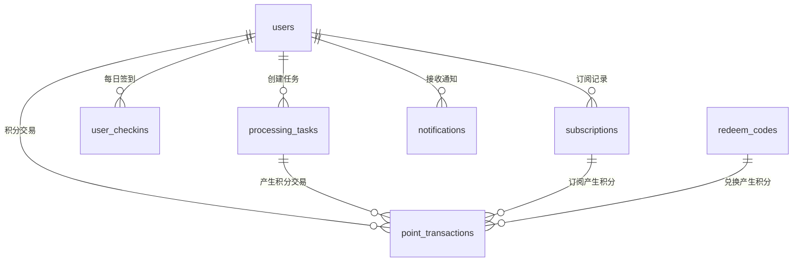

# 智译平台数据库设计文档

本文档详细描述了智译平台的数据库设计，包括表结构、关系和索引等信息。智译平台采用PostgreSQL数据库，使用Drizzle ORM进行数据库操作。

## 目录

- [数据库概览](#数据库概览)
- [表结构设计](#表结构设计)
  - [用户表 (users)](#用户表-users)
  - [处理任务表 (processing_tasks)](#处理任务表-processing_tasks)
  - [积分交易表 (point_transactions)](#积分交易表-point_transactions)
  - [用户签到表 (user_checkins)](#用户签到表-user_checkins)
  - [兑换码表 (redeem_codes)](#兑换码表-redeem_codes)
  - [订阅表 (subscriptions)](#订阅表-subscriptions)
  - [通知表 (notifications)](#通知表-notifications)
- [表关系图](#表关系图)
- [索引设计](#索引设计)
- [数据库迁移](#数据库迁移)

## 数据库概览

智译平台的数据库设计围绕以下核心实体：

1. **用户管理**：存储用户信息和积分余额
2. **任务处理**：记录文件处理任务及其状态
3. **积分系统**：管理积分交易、签到和兑换码
4. **订阅系统**：管理用户订阅计划和支付记录
5. **通知系统**：存储用户通知

数据库使用PostgreSQL，通过Drizzle ORM进行访问和操作，支持事务处理和复杂查询。

## 表结构设计

### 用户表 (users)

存储用户基本信息和积分余额。

| 列名 | 类型 | 约束 | 描述 |
|------|------|------|------|
| id | SERIAL | PRIMARY KEY | 自增主键 |
| user_id | VARCHAR(255) | UNIQUE, NOT NULL | 外部身份标识 |
| email | VARCHAR(255) |  | 邮箱（可为空，Casdoor 注册有邮箱时写入） |
| points | INTEGER | NOT NULL, DEFAULT 100 | 积分余额，新用户默认100积分 |
| has_infinite_points | BOOLEAN | DEFAULT false | 无限积分标识，管理员可设置 |
| membership_type | VARCHAR(50) | DEFAULT 'free' | 会员类型 |
| membership_expiry | DATE | | 会员过期日期 |
| created_at | TIMESTAMP | DEFAULT now() | 创建时间 |
| updated_at | TIMESTAMP | DEFAULT now() | 更新时间 |

### 处理任务表 (processing_tasks)

记录文件处理任务的详细信息和状态。

| 列名 | 类型 | 约束 | 描述 |
|------|------|------|------|
| id | SERIAL | PRIMARY KEY | 自增主键 |
| user_id | VARCHAR(255) | NOT NULL, FOREIGN KEY | 关联用户ID (users.user_id) |
| task_type | VARCHAR(50) | NOT NULL | 任务类型，如pdf-to-markdown等 |
| task_status | VARCHAR(20) | NOT NULL, DEFAULT 'pending' | 任务状态：pending, processing, completed, failed |

| status_message | TEXT | | 状态消息 |
| input_filename | VARCHAR(255) | NOT NULL | 输入文件名 |
| input_file_size | BIGINT | NOT NULL | 输入文件大小(字节) |
| input_storage_path | VARCHAR(500) | NOT NULL | 输入文件存储路径 |
| processing_params | JSONB | DEFAULT '{}' | 处理参数，JSON格式 |
| external_task_id | VARCHAR(255) | | 外部服务任务ID |
| required_points | INTEGER | DEFAULT 0 | 任务所需积分 |
| has_been_downloaded | BOOLEAN | DEFAULT false | 是否已被下载过 |
| result_storage_path | VARCHAR(500) | | 结果文件存储路径 |
| result_file_size | BIGINT | | 结果文件大小(字节) |
| result_filename | VARCHAR(255) | | 结果文件名 |
| error_code | VARCHAR(50) | | 错误代码 |
| error_message | TEXT | | 错误消息 |
| retry_count | INTEGER | DEFAULT 0 | 重试次数 |
| created_at | TIMESTAMP | DEFAULT now() | 创建时间 |
| started_at | TIMESTAMP | | 开始处理时间 |
| completed_at | TIMESTAMP | | 完成时间 |
| expires_at | TIMESTAMP | DEFAULT now() | 过期时间，默认7天后 |

### 积分交易表 (point_transactions)

记录用户积分的所有变动，包括消费、奖励、兑换码使用等。

| 列名 | 类型 | 约束 | 描述 |
|------|------|------|------|
| id | SERIAL | PRIMARY KEY | 自增主键 |
| user_id | VARCHAR(255) | NOT NULL, FOREIGN KEY | 关联用户ID (users.user_id) |
| task_id | INTEGER | FOREIGN KEY | 关联任务ID，可为空 |
| redeem_code_id | INTEGER | FOREIGN KEY | 关联兑换码ID，可为空 |
| amount | INTEGER | NOT NULL | 积分变动数量，正数为增加，负数为减少 |
| transaction_type | VARCHAR(50) | NOT NULL | 交易类型，如TASK_COST, CHECKIN, REDEEM等 |
| description | TEXT | NOT NULL | 交易描述 |
| created_at | TIMESTAMP | DEFAULT now() | 创建时间 |

### 用户签到表 (user_checkins)

记录用户每日签到信息。

| 列名 | 类型 | 约束 | 描述 |
|------|------|------|------|
| id | SERIAL | PRIMARY KEY | 自增主键 |
| user_id | VARCHAR(255) | NOT NULL, FOREIGN KEY | 关联用户ID (users.user_id) |
| checkin_date | DATE | NOT NULL | 签到日期 |
| points_earned | INTEGER | DEFAULT 10 | 获得积分，默认10分 |
| created_at | TIMESTAMP | DEFAULT now() | 创建时间 |

**唯一约束**: (user_id, checkin_date) - 确保用户每天只能签到一次

### 兑换码表 (redeem_codes)

存储积分兑换码信息。

| 列名 | 类型 | 约束 | 描述 |
|------|------|------|------|
| id | SERIAL | PRIMARY KEY | 自增主键 |
| code | VARCHAR(50) | NOT NULL, UNIQUE | 兑换码，唯一值 |
| points_value | INTEGER | NOT NULL | 积分价值 |
| max_uses | INTEGER | | 最大使用次数，NULL表示无限制 |
| current_uses | INTEGER | DEFAULT 0 | 当前已使用次数 |
| is_active | BOOLEAN | DEFAULT true | 是否激活 |
| expires_at | TIMESTAMP | | 过期时间，NULL表示永不过期 |
| created_at | TIMESTAMP | DEFAULT now() | 创建时间 |

**注意**: 用户兑换码使用记录直接记录在积分交易表(point_transactions)中，通过transaction_type='REDEEM'和redeem_code_id字段进行关联

### 订阅表 (subscriptions)

存储用户订阅和支付记录，支持PayPal支付验证和防重复处理。

| 列名 | 类型 | 约束 | 描述 |
|------|------|------|------|
| id | SERIAL | PRIMARY KEY | 自增主键 |
| user_id | VARCHAR(255) | NOT NULL, FOREIGN KEY | 关联用户ID (users.user_id) |
| plan_type | VARCHAR(50) | NOT NULL | 订阅类型：basic, standard, premium, addon |
| billing_type | VARCHAR(20) | NOT NULL | 计费类型：monthly, yearly, one-time |
| points_amount | INTEGER | NOT NULL | 订阅获得的积分数 |
| membership_duration | INTEGER | | 会员时长（天数），仅适用于非addon订阅 |
| membership_start_date | DATE | | 会员开始日期 |
| membership_end_date | DATE | | 会员结束日期 |
| casdoor_product_name | VARCHAR(100) | NOT NULL | Casdoor中的产品名称 |
| payment_id | VARCHAR(255) | | PayPal支付ID/交易ID，用于防重复处理 |
| amount | INTEGER | NOT NULL | 支付金额（美分） |
| currency | VARCHAR(10) | DEFAULT 'USD' | 支付货币 |
| next_points_date | DATE | | 下次积分发放日期（订阅制） |
| last_points_date | DATE | | 上次积分发放日期 |
| status | VARCHAR(20) | NOT NULL, DEFAULT 'active' | 订阅状态：active, expired, cancelled |
| is_active | BOOLEAN | DEFAULT true | 是否激活 |
| created_at | TIMESTAMP | DEFAULT now() | 创建时间 |
| processed_at | TIMESTAMP | | 支付处理时间 |

**安全特性**：
- **PayPal验证**：通过PayPal API验证支付真实性
- **重复检测**：使用payment_id防止重复处理同一笔支付
- **金额验证**：验证实际支付金额与预期金额一致
- **审计日志**：记录所有支付尝试和验证结果

### 通知表 (notifications)

存储用户通知信息。

| 列名 | 类型 | 约束 | 描述 |
|------|------|------|------|
| id | SERIAL | PRIMARY KEY | 自增主键 |
| user_id | VARCHAR(255) | NOT NULL, FOREIGN KEY | 关联用户ID (users.user_id) |
| task_id | VARCHAR(255) | | 关联任务ID，字符串格式 |
| type | VARCHAR(20) | NOT NULL | 通知类型：success, warning, info, error |
| title | VARCHAR(255) | NOT NULL | 通知标题 |
| message | TEXT | NOT NULL | 通知内容 |
| is_read | BOOLEAN | NOT NULL, DEFAULT false | 是否已读 |
| created_at | TIMESTAMP | DEFAULT now() | 创建时间 |

## 表关系图



## 索引设计

数据库中的主要索引包括：

1. **主键索引**：所有表都有自增主键id作为主索引
2. **外键索引**：所有外键关系自动创建索引，提高关联查询性能
3. **唯一索引**：
   - users.user_id：确保用户ID唯一
   - redeem_codes.code：确保兑换码唯一
   - user_checkins(user_id, checkin_date)：确保用户每天只能签到一次

## 数据库迁移

智译平台使用Drizzle ORM的迁移工具管理数据库结构变更。主要迁移历史包括：

1. **初始结构 (0000_sharp_silverclaw.sql)**：
   - 创建users、processing_tasks、point_transactions、redeem_codes和user_checkins表
   - 建立表间关系和约束

2. **添加通知表 (0001_vengeful_cobalt_man.sql)**：
   - 创建notifications表
   - 建立与users和processing_tasks的关系

3. **修改通知表结构 (0002_tricky_typhoid_mary.sql)**：
   - 将task_id列类型从INTEGER修改为VARCHAR(255)
   - 移除与processing_tasks表的外键约束

4. **添加通知已读状态 (0003_last_mariko_yashida.sql)**：
   - 在notifications表中添加is_read布尔字段

5. **用户表结构更新 (0004_user_membership.sql)**：
   - 将clerk_id列重命名为user_id
   - 修改默认积分从20改为100
   - 添加membership_type和membership_expiry字段

6. **签到奖励调整 (0005_checkin_points.sql)**：
   - 修改user_checkins表中points_earned默认值从5改为10

7. **添加用户邮箱列 (0001_add_email_to_users.sql)**：
   - 在users表中添加可为空的email列，注册时若Casdoor提供邮箱则写入

8. **添加订阅表 (0002_add_subscriptions_table.sql)**：
   - 创建subscriptions表，支持用户订阅管理
   - 建立与users表的外键关系
   - 支持PayPal支付验证和防重复处理

## 支付安全机制

智译平台实现了完整的PayPal支付安全验证机制：

### 安全验证流程

1. **用户身份验证**：确保只有登录用户可以处理支付
2. **参数完整性检查**：验证支付ID、产品信息等必要参数
3. **重复支付检测**：检查数据库中是否已处理过相同的paymentId
4. **PayPal API验证**：
   - 通过PayPal REST API验证支付真实性
   - 检查支付状态为"approved"和"completed"
   - 验证PayerID匹配性
5. **金额验证**：确保实际支付金额与产品价格一致
6. **审计日志记录**：记录所有支付尝试、验证结果和错误信息

### 环境配置

支付系统需要以下环境变量：

```bash
# PayPal API配置
PAYPAL_CLIENT_ID=your_paypal_client_id
PAYPAL_CLIENT_SECRET=your_paypal_client_secret
PAYPAL_SANDBOX=false  # 生产环境设为false
```

### 防护措施

- ❌ **阻止URL直接访问**：用户无法通过直接访问成功页面URL获得奖励
- ✅ **真实支付验证**：所有支付必须通过PayPal API验证
- ✅ **重复处理防护**：同一笔支付只能处理一次
- ✅ **金额一致性检查**：防止金额篡改
- 📝 **完整审计追踪**：记录IP地址、User-Agent等信息便于安全分析

